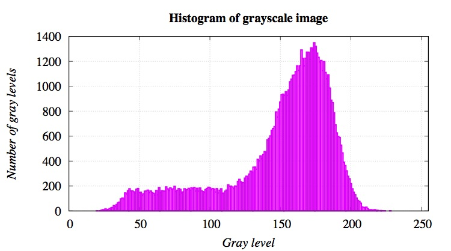
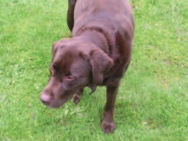
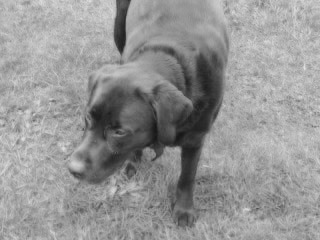
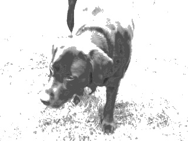

## Change the contrast of grayscale image

### Model
In this post will show how  to change the contrast of grayscale image using OpenCV.  The process use two commonly operations: multiplication and addition with a constant:


where,  are the source image pixels ,  are the output image pixels. The parameters  and  are often called the gain and bias parameters; sometimes these parameters are said to control contrast and brightness respectively.

### Run Code

There are 1 file:
* histogram.cpp

Simply compile and run. There is a Makefile for a fast test.

#### C++
```
make
./histogram <input_file> <output_file>
```
#### Options.

	/* ------ Example 1: ---- */
	{
	histogram 1.0.3
    Usage: histogram file1 file2 

	-?, -h, --help, --usage
		options

	file1
		image (a) input
	file2
		image (b) output
	}
	
#### Example
```
 ./histogram dog.jpg dog_contrast.jpg
```
#### Plotting Histograms
The histogram represents for each color level the number of pixels with that color level. A dark image will have many pixels with low color value and thus the histogram will present a peak in his left part.



### Sample Result
Change of image contrast between gray intervals [0,50] and [80,140].




